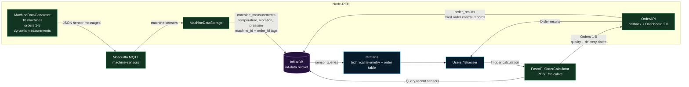

# IoT Machine Monitoring Architecture

PowerPoint-ready landscape version: [architecture.svg](D:/Projects/Src/iot-demo/architecture.svg)

## Data behavior

- Sensor measurements are continuously generated for 10 machines and assigned to orders 1–5.
- Sensor data is published to MQTT topic `machine-sensors`.
- InfluxDB stores technical fields: temperature, vibration, and pressure.
- Grafana visualizes telemetry grouped by `order_id`.
- `POST /calculate` triggers `OrderCalculator`.
- `OrderCalculator` reads sensor data, calculates quality and delivery dates, and calls Node-RED `/orderapi`.
- Node-RED stores fixed order-control records in the `order_results` measurement and displays them in Dashboard 2.0.
