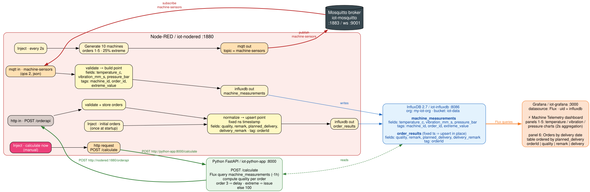
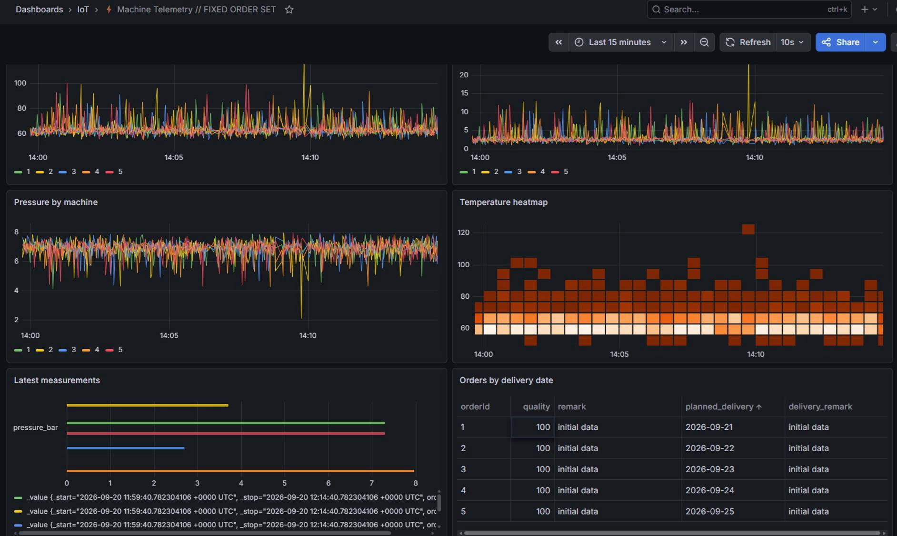
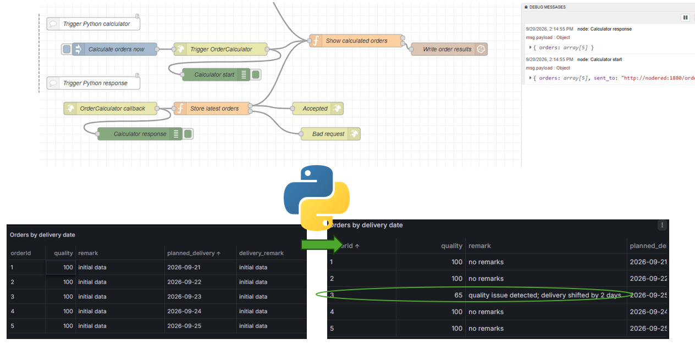

# IOT DEMO Environment
A working IoT demo environment that can be used for presentations, and quick POC. This showcases a offline/local processing environment, that is able to process telemetry data, make calculations, and dashboarding. 

This is a (Dev on), Docker Compose stack featuring MQTT (Eclipse Mosquitto), Node-RED, InfluxDB, Grafana, and a Python environment.This stack includes persistent data storage, pre-created networks for secure container communication, and automatic container restarts.
- Grafana: Dashboard
- Influx: Timeseries database
- Mqtt: Broker
- Node-Red: Orchestrator

## Demo workflow
- Publisher: Sensor telemtry (simulated) is published to a Mqtt topic (this is not yet Unified Namespace - standardised data set, but is a separate flow to support this)

- Consumer: Mqtt -> InFlux (telemetry data is stored into a timeseries database)

- Visualisation: Grafana is querying data from Influx in a dashboard showing: raw telemetry data & order data

- Trigger: A Python FastAPI can be called, which queries the InfluxDb (could be used to retrieve any other data), simulates a hardware issue, and recalcutes the order delivery planning / quality with remarks and calls an endpoint on Node-Red (Orderupdate)

- OrderUpdate: The order is updated in InfluxDb, and is shown in Grafana

- The seperation of concerns allows the technology to be replaced by other systems. This demo shows the possible architecture for local Edge device processing. This could be done with an Edge gateway on the telemetry side instead of the simulated dataset.

### Architecture

### Dashboard

### Order update from Python

### Windows
If Docker desktop is running, from vs-code simply run: start-iot-stack.ps1 and the containers will be created and the endpoints are opened in the browser.

# Endpoints
Internal Network hostnamesBecause all services are linked on the iot-network bridge, they can talk to each other securely using their service names instead of IP addresses:

- InfluxDB (UI) http://influxdb:8086 / http://localhost:8086
- Node-RED (UI) http://nodered:1880 / http://localhost:1880
- Grafana (UI) http://localhost:3000
- MQTT Broker (Endpoint / no UI) http://mosquitto:1883 / 

# Accounts
Grafana, admin / admin
InfluxDB admin / ChangeThisSecurePassword123! (org: my-iot-org, bucket: iot-data)
Node-RED: none
Mosquitto: none (allow_anonymous true set in the config)

### Mosquito
Required Configuration Before LaunchingMosquitto 2.0+ requires an explicit configuration file to allow external local traffic. Before running docker compose up, follow these two steps:

1. Create a directory named mosquitto and a subdirectory named config.

2. Inside ./mosquitto/config/, 
    create a file named mosquitto.conf and paste this content:textlistener 1883
    allow_anonymous true

## TODO
- Switch Mosquito to https://hub.docker.com/r/emqx/emqx
- Consider alternative options for Node-Red

# ABOUT
This demo has been developed by consulting company https://www.itconnector.nl. 
For more information, contact me at:
- sander@itconnector.nl
- https://www.linkedin.com/in/sandernefs/